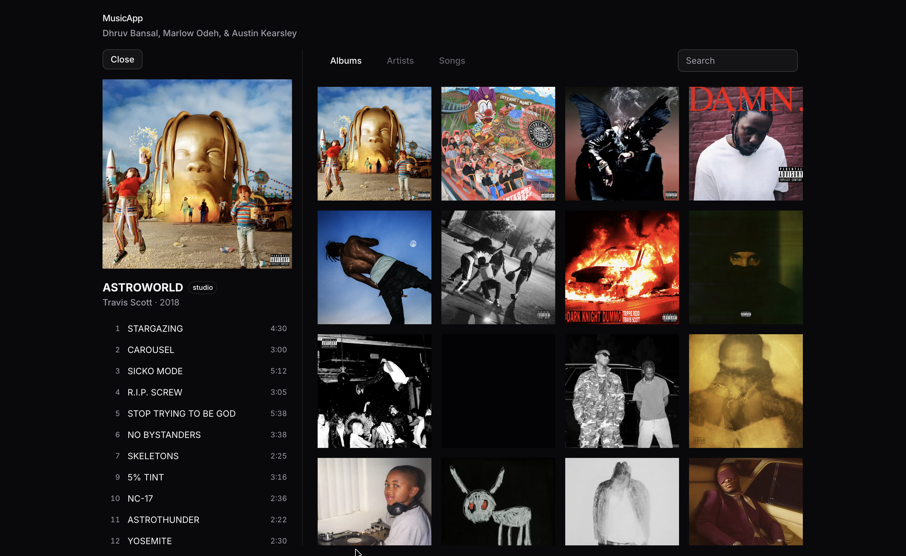
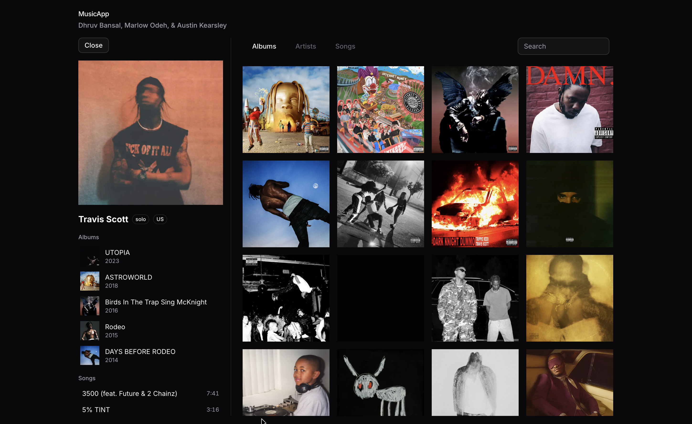
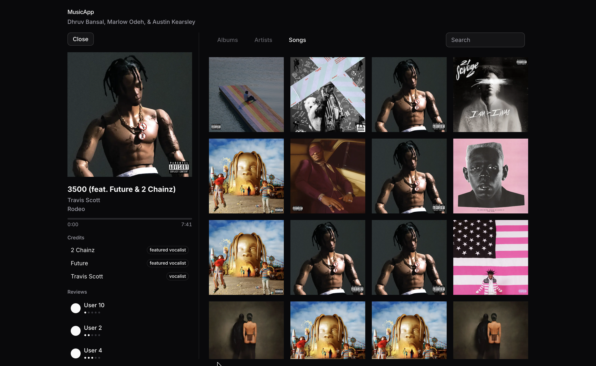

# CSE 412 Music Database App

**Team 24** - Dhruv Bansal, Marlow Odeh, & Austin Kearsley

A music information database that lets users browse artists, albums, songs, credits, and reviews. Built with Next.js, FastAPI, and PostgreSQL.

## Application Walkthrough

### 1. Browse Albums

The landing page displays all albums as a grid of cover art. Hover over any album to see its title and artist.


### 2. Browse Artists

Switch to the Artists tab to see all artists with their photos in a grid layout.


### 3. Browse Songs

The Songs tab shows every song in the database, displayed with its album artwork.


### 4. Album Detail

Click any album to open a detail panel showing the cover art, title, type, artist, release year, and full track listing with durations.



### 5. Artist Detail

Click an artist to see their photo, type, country, discography, and all songs they appear on.



### 6. Song Detail with Credits & Reviews

Click a song to view its metadata, contributing artist credits with roles (vocalist, featured vocalist), and user reviews with star ratings.



## Database

The database dump is located at [`apps/api/db/phase3_dump.sql`](apps/api/db/phase3_dump.sql). It contains all schema definitions and data for the following tables:

| Table | Rows | Description |
|-------|------|-------------|
| Artist | 53 | Artists with name, country, type, and image |
| Album | 44 | Albums with title, type, release date, and cover art |
| Song | 144 | Songs with title, duration, and track number |
| User | 10 | Application users |
| Credits | 239 | Artist-song credit links with roles (M:N) |
| Review | 583 | User ratings for songs (M:N) |

To restore the database from the dump:

```bash
docker compose up -d
docker exec -i cse412-musicapp-db-1 psql -U dhruv -d postgres < apps/api/db/phase3_dump.sql
```

## Prerequisites

- [Bun](https://bun.sh)
- [uv](https://docs.astral.sh/uv/)
- [Docker](https://www.docker.com/) (for PostgreSQL)

## Quick Start

```bash
# 1. Install JS dependencies
bun install

# 2. Start PostgreSQL
docker compose up -d

# 3. Load data into the database (from apps/api)
cd apps/api
uv run scripts/load_csv_to_postgres.py

# 4. Start both the API and web app
cd ../..
bunx turbo dev
```

The web app runs at [http://localhost:3000](http://localhost:3000) and the API at [http://localhost:8000](http://localhost:8000).

## Project Structure

- `apps/web` - Next.js frontend (React, Tailwind CSS, shadcn/ui)
- `apps/api` - FastAPI backend with PostgreSQL (raw SQL via psycopg2)
- `apps/api/db/` - Schema definitions and database dump
- `apps/api/data/` - CSV data files loaded into the database
- `apps/api/scripts/` - Data scraping (Spotify) and loading scripts
- `screenshots/` - Application screenshots
