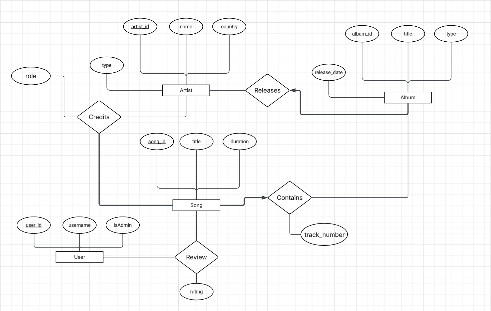

# API

FastAPI backend for the music database. Serves REST endpoints for artists, albums, songs, users, and reviews.

<p align="center">
  
</p>

## Setup

```bash
# Start PostgreSQL
docker compose up -d   # from repo root

# Fetch data from Spotify (only needed once)
uv run scripts/get_data.py

# Load CSV data into PostgreSQL
uv run scripts/load_csv_to_postgres.py

# Run the API
uv run uvicorn main:app --reload --host 0.0.0.0 --port 8000
```

## Endpoints

| Method | Path | Description |
|--------|------|-------------|
| GET | `/api/artists` | List/search artists |
| GET | `/api/artists/:id` | Artist detail with albums and songs |
| GET | `/api/albums` | List/search albums |
| GET | `/api/albums/:id` | Album detail with track list |
| GET | `/api/songs` | List/search songs |
| GET | `/api/songs/:id` | Song detail with credits, reviews, avg rating |
| GET | `/api/users` | List users |
| POST | `/api/users` | Create user |
| DELETE | `/api/users/:id` | Delete user and their reviews |
| POST | `/api/reviews` | Create review |
| PUT | `/api/reviews` | Update review rating |
| DELETE | `/api/reviews/:uid/:sid` | Delete review |
